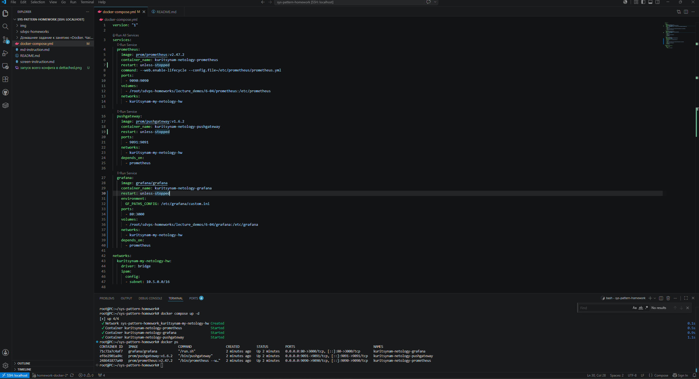
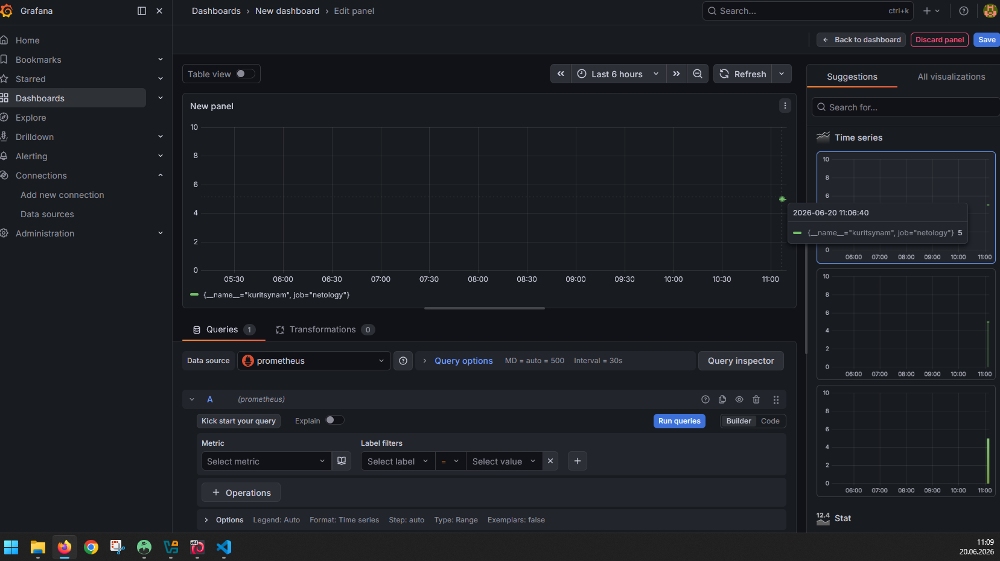
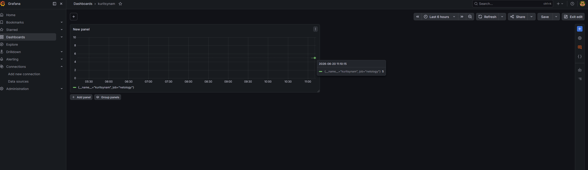
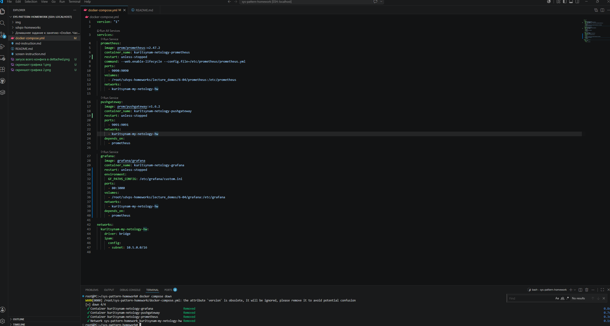

#Домашнее задание к занятию "Домашнее задание к занятию «Docker. Часть 2»" - `Курицын Александр`


### Задание 1

`Docker Compose улучшил мою жизнь благодаря тому, что не нужно писать параметры запуска для каждого контейнера в командной строке. Достаточно один раз описать.yaml файл со всеми сервисами, сетями, параметрами, томами и т.д., что очень облегчило сопровождать сервисы которые в нем крутились`


### Задание 2


```
version: "1"
services:
volumes:
networks:
  kuritsynam-my-netology-hw:
    driver: bridge
    ipam:
      config:
      - subnet: 10.5.0.0/16
```


---

### Задание 7

[docker-compose.yml](docker-compose.yml)

Скриншот запуска контейнеров в dettached


Скриншот графика метрики №1


Скриншот графика метрики №2


---

### Задание 8

Скриншот консоли с остановкой и удалением контейнеров

